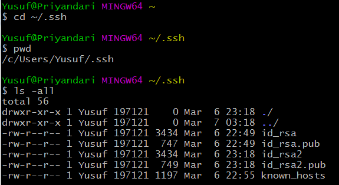

# Pengantar Git Version dan Github
## Git
Git adalah program yang digunakan untuk menyimpan dan mengelola versi-versi file pekerjaan. Pengeloaan file tersebut dilakukan di dalam komputer secara lokal.

Ilustrasi versi file dapat diibaratkan seperti kita membuat file dokumen (file_1.doc, file_2.doc, dan seterusnya sampai file_final.doc) dimana nomor menunjukkan versi kebaruan dari file pekerjaan. Daripada membuat dan menyimpan banyak file dengan nomor yang berbeda setiap melakukan perbaikan dokumen, maka program **Git** membantu dalam menyimpan **hanya versi perubahan** dalam file dokumen yang sedang dikerjakan. Dengan demikian, cukup membuat sebuah nama file.doc, kemudian setiap ada perubahan atau perbaikan, disimpan informasi perubahan menggunakan mekanisme program Git tersebut.

Keuntungan sederhana lainnya menggunakan program Git adalah bisa melihat perubahan-perubahan pada setiap versi file dan apabila diperlukan, *set back* ke versi terdahulu/lama dari suatu file yang sedang dikerjakan.

## Github
[Github.com](github.com) adalah tempat menyimpan file-file versi pekerjaan dalam suatu repositori (folder) secara online. Github adalah salah satu penyedia, ada banyak penyedia repositori versi pekerjaan online lainnya. Keuntungan menggunakan tempat penyimpanan secara online untuk versi-versi file pekerjaan adalah:
  1. dapat diakses dari berbagai perangkat secara online,
  2. dapat diakses oleh lebih dari satu orang untuk bekerja secara kolaboratif


## Instalasi Git dan Registrasi Akun [Github](github.com)

Sesi ini belum menjelaskan bagaimana proses instalasi git dan registrasi akun [Github](github.com). Diasumsikan pembaca bisa melakukan secara mandiri prose-proses
 1. Download program [Git](https://git-scm.com/downloads)
 2. Instalasi program **Git**.
 3. Registrasi akun pada [Github](github.com)


## Membuat Repositori (Folder) pada [Github.com](github.com)

Langkahnya sebagai berikut:
 1. Login menggunakan akun github.
 2. Klik tombol tab **Repositories** --> **New**
 3. Isikan nama repo (folder) yang diinginkan. Sebagai contoh, foldernya bernama `git-version`.
 4. Tuliskan deskripsi singkat mengenai folder yang dibuat. Contoh: `Folder ini menyimpan tutorial sederhana penggunaan git dan github`.
 5. Tandai (check) pada bagian `[ ] Add a README file` dan abaikan lebih dahulu pilihan-pilihan lainnya
 6. Klik tombol **Create Repository**


## Membuat Clonning Folder dari <a href="github.com">Github </a> ke dalam Folder Komputer Lokal

### A. Setting ssh-key di Komputer

Langkah-langkahnya sebagai berikut:

1.Jalankan `Git Bash`, kemudian ketik perintah:
```commandline
ssh-keygen -t rsa -b 4096 -C "akun_emailmu_di_github@contoh.com"
```
2.Jika muncul pertanyaan :
```commandline
Enter a file in which to save the key (/c/Users/you/.ssh/id_rsa):[Tekan enter saja]
```
3.Masukkan passphrase (password) akun [github](github.com) :
```
Enter passphrase (empty for no passphrase): [Ketik password]
```
4.Ketik perintah ini untuk menuju pada folder berisi ssh-key
```
cd ~/.ssh
pwd
ls -all
```
Anda akan melihat beberapa file
    

5.Lokasi file tersebut biasanya di `C:\Users\Nama_Useer\.ssh`. Buka file `id_rsa.pub` menggunakan editor, misal `notepad++` atau editor lainnya, dan copy seluruh isi file tersebut. Isi file tersebut akan di `paste` pada setting **ssh-key** di [github](github.com)


### B. Menambahkan ssh-key ke [github](github.com)

Langkah lanjutan proses A sebagai berikut:

1. Buka Account Setting pada Profil Github.com Anda
2. Pilih menu **SSH and GPG Keys**
3. Klik tombol **New SSH key**. Isikan title, misal `ThinkPad T420s` (nama komputer sebagai pengenal)
4. Pada isian Key, **Paste** ssh-key yang telah di copy dari file `id_rsa.pub`.
5. Simpan perubahan.


### C. Clone Repo dari  [Github](github.com) ke Komputer

Langkahnya sebagai berikut:

1. Buka repositori [Github](github.com) yang telah dibuat `(git-version)`
2. Pilih branch yang akan di kloning.
3. klik tombol **Code** berwarna hijau, lalu pilih tab **SSH**, dan klik tombol **Copy** untuk menyalin url alamat repositori.
4. Buka Git Bash, dan posisikan kursor pada folder dimana Anda akan menempatkan folder clonning dari Repo Github.com.  Ketik perintah clone.  Penjelasan: -o digunakan untuk mengganti nama origin menjadi nama alias dari remote sesuai keinginan. -b digunakan untuk memilih sepsifik branch yang akan di clone.

    ``` git clone -o [shortcut_name] -b [branch_name]  git@github.com:[username_anda]/git-version.git ```
       
5. Setelah download clone selesai, pada direktori Anda akan ada sebuah folder yang namanya sama dengan nama folder repo dari github. [ Anda boleh melakukan rename atau memindahkan ke tempat lain.]

6. Masuklah ke dalam direktori tersebut menggunakan baris perintah di Git Bash, misal

    ```cd [nama_direktori_repo]```

7. Ketik perintah ini untuk melihat hasilnya.

    ```git remote -v```

8. Tambahkan proses configurasi folder

    ```
   git config --local user.email "email_anda@github"
   
   git config --local user.name "Nama Anda"

    git config --local user.username username_anda
   ```

9. Coba test untuk lakukan `push` (sinkronisasi dari folder lokal ke repo github). Jika ditanyakan parapharse (password), maka isikan password. Jika ada pesan `Everything up-to-date`, berarti telah berhasil. 

    ```git push```
    
    ```Enter passphrase for key '/c/Users/Yusuf/.ssh/id_rsa':```
    
    ```Everything up-to-date```

10. Agar tidak ditanyakan berulang password, maka jalankan perintah pada git bash

   ``` 
   eval 'ssh-agent' 
   
   ssh-add ~/.ssh/id_rsa 
   ```


### TODO